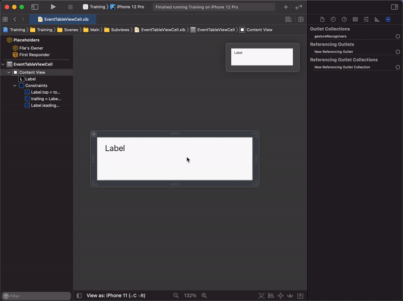

# Interface Builderの使い方

Xcodeはとても強力なIDEで、様々な機能が沢山あります。 
その代償に初めて見る人にとっては *"何をどう操作すればよいか"*、 *"どんな機能があるのか"* が分かりづらいと思います。

ここではXcodeのUI Editorの機能、操作方法を説明します。

## 主に行う動作

### Viewの追加方法

`cmd`+`L` でViewの一覧パネルが表示されます。 
表示されているViewをドラッグ&ドロップ、または`Enter`でViewを追加出来ます。

### Constraintsの追加方法

Constraints Panelを選択してConstraintsを追加しています。

### Swiftファイルとの紐付け方法

`Assistant`エディターを表示し、`Ctl`を押しながらドラッグ&ドロップすることでSwiftファイルと紐付けています。

## 各機能、Windowの説明

### View Hierarchy

Viewの階層を表示するWindowです。 
階層の並びが上のViewの方が画面上でも上に表示されます。

### Editor Options

Editorに追加で表示するものを選択するパネルです。 
Swiftファイルとの紐付けの際に`Assistant`を選択することで、後述する`Custom Class`で指定したファイルを開き、紐付ける作業を簡単にしてくれます。

### Inspector

Xcodeの右側にあるWindowです。

| File | History | Help | Identity | Attributes | Size | Connections |
|:---:|:---:|:---:|:---:|:---:|:---:|:---:|
||||||||

#### File Inspector

File名や属するTargetなど、File全体の設定を行う場所です。 
主にSafe Area Guidelinesを使うかどうか指定する`Use Safe Area Guidelines`と属するTargetを指定する`Target Membership`で使います。

#### History Inspector

git blameで見れる様なコードの変更履歴を見る場所です。 
使うことは稀でしょう。

#### Help Inspector

カーソルを当てているクラスのDocumentが見れます。 
使う頻度は少ないと思います。

#### Identity Inspector

カーソルを当てているViewのIdentityを指定する場所です。 
主に紐付いているSwiftファイルを指定する`Custom Class`を使う程度です。 
後述するAttributes Inspectorに表示されていないAttributesを指定するのにも使用します。

#### Attributes Inspector

カーソルを当てているViewの属性を編集する場所です。 
一番使用する頻度が高いInspectorだと思います。 

#### Size Inspector

カーソルを当てているViewのサイズやLayout Constraintsを編集する場所です。 
主にViewに付けているConstraintsを確認･編集したり、コンテンツの潰れにくさを指定する`Content Compression Resistance Priority`、広がりにくさを指定する`Content Hugging Priority`を指定する際に使用します。 

#### Connections Inspector

カーソルを当てているViewがSwiftファイルのどこに紐付けられているか確認する場所です。 
ここから`Ctl`を押しながらドラッグすることでSwiftファイルに紐付けることも可能です。

### Panel

| Align | Constraints | Resolve auto layout issues | Embed in |
|:---:|:---:|:---:|:---:|
|||||

#### Align Panel

選択した複数のViewを整列させたり、中央に置きたいときに使用します。 

#### Constraints Panel

ViewのConstraintsを指定します。 
`基本的にViewを置く`→`Constraints PanelでConstraintを付ける`という作業がViewを作るときの基本動作と言えます。 
`Constraints to margins`をマージンを含めたConstraintsを付けてくれます。 
基本的に使わないですが、チェックしていると思い通りのマージンにならないので注意しましょう。

#### Resolve auto layout issues Panel

絶対パスでレイアウトを組むのではなく、Constraintsを付けることでレイアウトを組むことをAuto Layoutと言います。 
ここではAuto Layoutで発生したエラーを自動的に解消するのに使用します。 
基本的に意図通りにならないことが多いのであまり使用しません。

#### EmbedIn Panel

選択した複数のViewを`UIView`や`UIStackView`, `UIScrollView`に内包させるときに使用します。 
View HierarchyのWindowでドラッグ&ドロップでもViewの階層を編集できるため、あまり使用しません。
