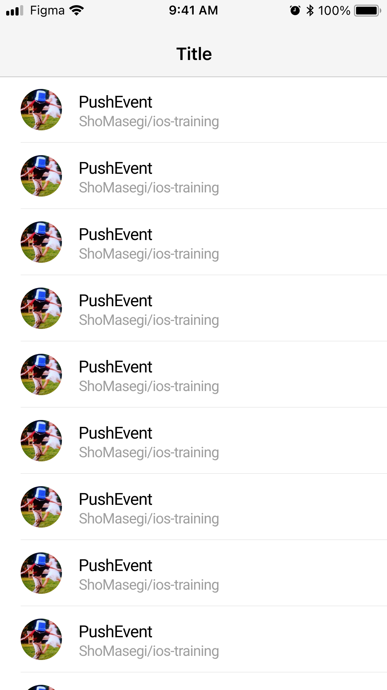
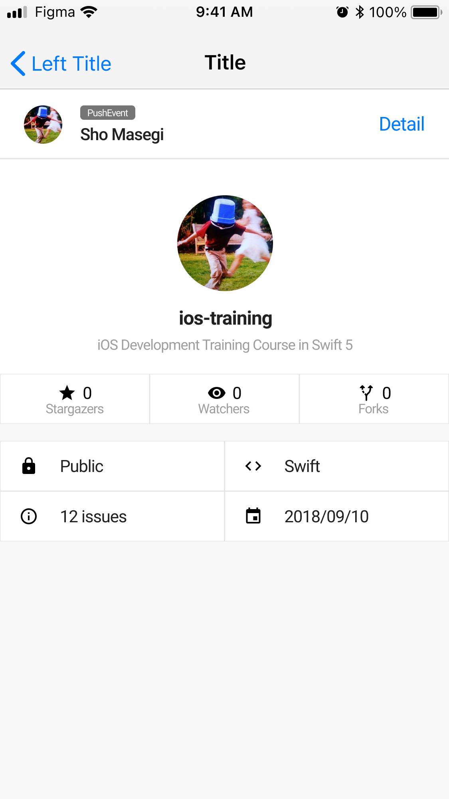
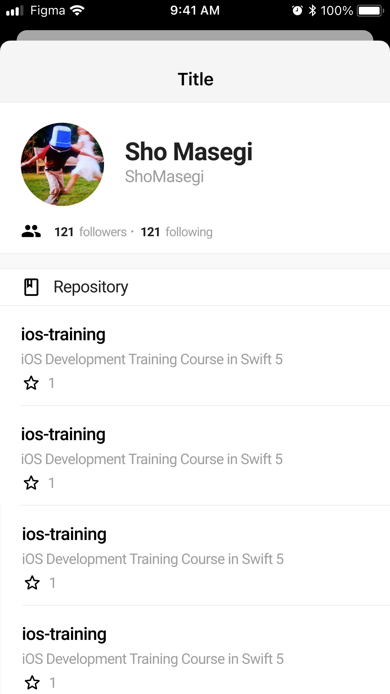

# ios-training

業務に近い形でアプリ開発を行い、iOSアプリ開発の立ち上がりを修了していただきます。

## 概要

GitHubクライアントアプリを開発していただきます。

デザイン: [ios-training - Figma](https://www.figma.com/file/B0Pp2PNSmTugNxQ01dKeiy/ios-training)

| Events | Repository | User |
|:---:|:---:|:---:|
||||

### GitHub API

使用するGitHub APIは以下の4つです。

- [[GET] /events](https://docs.github.com/ja/rest/reference/activity#list-public-events)
- [[GET] /repos/{owner}/{repo}](https://docs.github.com/ja/rest/reference/repos#get-a-repository)
- [[GET] /users/{username}](https://docs.github.com/ja/rest/reference/users#get-a-user)
- [[GET] /users/{username}/repos](https://docs.github.com/ja/rest/reference/repos#list-repositories-for-a-user)

### 進め方

既にベースになるプロジェクトは作成済みです。

こちらを基に機能追加という形で開発していただきます。

1. こちらのレポジトリをご自身のGitHubアカウントでForkする。
2. `$ make install`を実行しsetupを行う。（実行している内容は[こちら](./Makefile)
3. [Training.xcworkspace](./Training.xcworkspace)をXcodeで開いて開発を進める

🚧 Step毎に課題を用意する予定です。