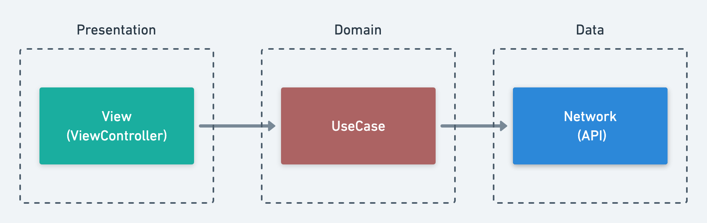

# ios-training


業務に近い形でアプリ開発を行い、iOSアプリ開発の立ち上がりを修了していただきます。

## 概要

GitHubクライアントアプリを開発していただきます。

デザイン: [ios-training - Figma](https://www.figma.com/file/B0Pp2PNSmTugNxQ01dKeiy/ios-training)

| Events | Repository | User |
|:---:|:---:|:---:|
||||

### GitHub API

使用するGitHub APIは以下の4つです。

- [[GET] /events](https://docs.github.com/ja/rest/reference/activity#list-public-events)
- [[GET] /repos/{owner}/{repo}](https://docs.github.com/ja/rest/reference/repos#get-a-repository)
- [[GET] /users/{username}](https://docs.github.com/ja/rest/reference/users#get-a-user)
- [[GET] /users/{username}/repos](https://docs.github.com/ja/rest/reference/repos#list-repositories-for-a-user)

### 進め方

既にベースになるプロジェクトは作成済みです。<br>
こちらを基に機能追加という形で開発していただきます。

1. こちらのレポジトリをご自身のGitHubアカウントでForkする。
2. [こちら](#セットアップ)を参考にセットアップを行う。
3. [Training.xcworkspace](./Training.xcworkspace)をXcodeで開いて開発を進める。

🚧 Step毎に課題を用意する予定です。

### セットアップ

```shell
$ brew install rbenv
$ make install
```

1. [rbenv](https://github.com/rbenv/rbenv) をインストールして特定のruby versionをインストール出来るようにする。
2. `make install`を実行し依存ツール･ライブラリをインストールする。（実行内容は[こちら](./Makefile)）


## ベースプロジェクトの構成

### Dependency

#### Package Manager

- Swift Package Manager
- Cocoapods
- bundler

**Ref**

- [iOSアプリ開発にSwift Package Managerを使おう - Qiita](https://qiita.com/hironytic/items/09a4c16857b409c17d2c)
- [【Swift】CocoaPods導入手順 - Qiita](https://qiita.com/ShinokiRyosei/items/3090290cb72434852460)
- [bundler で cocoapods そのもののバージョン管理をする - Qiita](https://qiita.com/shinkuFencer/items/821501cd0c5c460c1fea)

#### Library

- [Alamofire/Alamofire: Elegant HTTP Networking in Swift](https://github.com/Alamofire/Alamofire)
- [mac-cain13/R.swift: Strong typed, autocompleted resources like images, fonts and segues in Swift projects](https://github.com/mac-cain13/R.swift)

### アーキテクチャ

Clean Architecture を簡略化したものを使用しています。<br>
`View`から`UseCase`を呼び出し、`UseCase`が`Network(API)`から取得した情報を返しています。




#### DI (Dependency Injection)

Presentation層のクラスをテストしやすくするため、`UseCase`をDIしています。

```swift
final class MainViewController: UIViewController {
    struct Dependency {
        var getEventsUseCase: GetEventsUseCase = GetEventsDefaultUseCase()
    }
    
    // ...
    
    private let dependency: Dependency

    // MARK: - Initializer

    private init(coder: NSCoder, dependency: Dependency) {
        self.dependency = dependency
        super.init(coder: coder)!
    }
}

// MARK: - Instantiate

extension MainViewController {
    static func instantiate(dependency: Dependency = .init()) -> Self {
        R.storyboard.main().instantiateInitialViewController { coder in
            Self(coder: coder, dependency: dependency)
        }!
    }
}
```

> [MainViewController.swift](./Training/Scenes/Main/MainViewController.swift) 

## その他参考になる研修資料

### yumemi-inc

- [yumemi-inc/ios-training: 株式会社ゆめみ iOS研修](https://github.com/yumemi-inc/ios-training)

### mixi-inc

- [mixi-inc/iOSTraining: Training course repository for iOS app development](https://github.com/mixi-inc/iOSTraining)
- [mixigroup/ios-swiftui-training](https://github.com/mixigroup/ios-swiftui-training)
- [ミクシィのiOS新卒研修資料を公開しました - mixi developers - Medium](https://medium.com/mixi-developers/2021-ios-mixi-training-d981b62e680f)